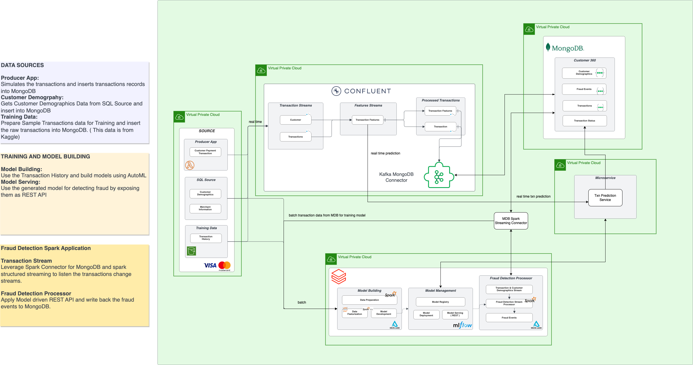

# Fraud Detection 

DEMO VIDEO : 

### Introduction
 Fraud prevention in the banking and financial services industry is the process of identifying, preventing and mitigating fraudulent activities to protect customers' assets and the financial institution's reputation. Banks and other financial institutions are particularly vulnerable to fraud because they handle large amounts of sensitive financial information and transactions.

 The approch taken to solve the above use case heavily relies on stream processing. We have provided this git to process the transaction using MDB spark streaming connector as in [Architecture 1](#architecture-1). Also we present an alternative approach using confluent and kafka stream for processing stream data in [Architecture 2](#architecture-2)(No code provided for the same in this git hub)

### Architecture 1

The high level architecture components for implementing the real time fraud detection model is as below:
1. [Producer apps & SQL data source](/mobile-demo/backend-service/serve.py) : The producer app is a simulator that mimics generation of transactions. The SQL source has been included as a sample operational data source that holds customer demographics
2. [MongoDB Atlas](#collections): Atlas serves as the core persistence layer and stores the raw transactions, the transactions flagged as fraud as well as customer demographics information.
3. [Fraud detection layer on Databricks](#notebooks): The core fraud detection algorithm is a reference notebook provided by Databricks. MLFlow has been used to manage the MLOps for this model. The trained model is available as a REST endpoint. The model is also operating on a Delta live table to provide batch/ real time predictive analytics. Deltalake has been used as the persistence on Databricks
4. [MongoDB Atlas Appservices](#atlas-trigger-function): Altas Appservice help manager the trigger function to listen to the featurized transaction collection and tag the transactions in realtime by invoking the AI/ML REST endpoint in Databricks.

### Architecture 2

When it comes to streaming data from MongoDB to Databricks, using Confluent is a popular solution. The process involves utilizing the MongoDB Kafka Source Connector and the Databricks Sink Connector. The Kafka Source Connector enables the extraction of data from MongoDB, and pushes it to a Kafka topic. The Databricks Sink Connector then reads the data from the Kafka topic and writes it to Databricks. The entire process is streamlined and enables near real-time data streaming, making it an efficient and reliable way to move data between the two platforms. By using these connectors together, it's possible to quickly and easily transfer large amounts of data from MongoDB to Databricks, facilitating smooth and efficient data processing. Refer the following documentation for more details.
- [MongoDB to Confluent using Source Connector](https://docs.confluent.io/cloud/current/connectors/cc-mongo-db-source.html#quick-start)
- [Confluent to Databricks using Sink Connector](https://docs.confluent.io/cloud/current/connectors/cc-databricks-delta-lake-sink/cc-databricks-delta-lake-sink.html#databricks-delta-lake-sink-connector-for-ccloud)

 ## Notebooks
 
 ### Model Training and Registeration

* Trains and Registers a Model based on Rules 

   [Fraud_demo_rule_dag.ipynb](BFSI/notebooks/Fraud_demo_rule_dag.ipynb)

* Trains and Registers a Model based on Classification using XGB.
 
   [Fraud_demo_model_training.ipynb](BFSI/notebooks/Fraud_demo_model_training.ipynb)
 
 

 ### Data Collection / Featurization and Streamoing

* Load Realtime data from mongodb > extract features > write to mongodb

   [Fraud_demo_streaming.ipynb](BFSI/notebooks/Fraud_demo_streaming.ipynb)

* Load one time batch data incrementally to train model

  [Fraud_demo_data_transform.ipynb](BFSI/notebooks/Fraud_demo_data_transform.ipynb)
 
 
  ## Training ML Models using Databricks/ML flow/Feature store
 
 #### Data collections

 Using MongoDB Spark Connector load historical transactions data from MongoDB fraud-detection.txn_data collection to Delta live tables. This is one time dump run each time to update the Delta live table (DLT) with new transactions that have been processed between subsequent runs of this step. This stage helps extracting relevant features from the raw transactions data and create a featurized view to be easily consumed for ML model training. Also The DLT is registered as Feature store. This help maintain,verisoning, lineage for features created over time. 

 ##### Input : transactions
 ##### Output : 
 raw transaction data in mongodb
 
 processed trainsaction in feature store
 

 #### xgb-model for User Agnostic transaction classification

We build a simple XGB classifier over the extracted features stored in the feature store. Using the MLflow we are able to track num of estimators used for modelling, ,model accuracy, auc to maitain details of various interations and also monitor the model performance over time. Based on the performance of the model run we promote the model to staging enviroment and post testing all the integration steps the model can be promoted to production enviroment.

Model Run Info

Model Run Registry

#### rule-based-predict
 
Similar to the previous XGB model run. We can wrap the xgb model with some user set rule on user application to validate transactions. The model first executes the rule check by using cc_num and make a request to fraud-detection.usr_auth_rule_data collection to fetch use specific and validate the transaction features against the same. Once all the rules are satificatorily processed the transaction is verified using the XGB model built above. The combined model now is registered using ML flow. This help is versioning and maintaining various rule features introduced/removed/changed over time.

Example view of rule collection

Rule Model Execution Flow

#### Create Workflows

Create two workflows one for model training activity and second for realtime processing of transactions. The second workflows are continously running jobs whereas the model training worflow is scheduled to run at regular intervals.
[Follow steps in link to create new worflow](https://docs.databricks.com/workflows/jobs/jobs-quickstart.html)

Once successfully created workflow will look as follows
Model training workflow

Streaming Worflow

#### rule-processed-mongo-sink

Reads the processed_transaciton DLT stream continuously and write into mongo collection.

### Collections

1. transactions 
   Inserts all the raw transactions as it is received from the simulator.
   
   

2. processed transactions post feature transformation :
   Inserts the processed transaction run against the feature extraction. 
   This collection would have a featurized view of the raw transaction to be used for classificaiton of the txn a fradulent or not.
   Against this collection we set the tigger function. Upon insert or update on this collection we use the Appservice txnpred func to call the classifier.
   
   

3. transaction status table :  
   The pred function from Atlas App service inserts the processed transaction run against the classification model.
   This collection would have a transaction status column added to show the prediction value when run against the transaction record, also carries the transaction number for identification.
   
   

### Transaction Simulation

A simple python program to simulate the Transaction of record being inserted every 1 min. It randomly generates valid/fraud transactions and inserts them to the raw transactions.

### Model REST Endpoints

[DEMO](https://youtu.be/Gig3Yn2QG1c)

Databricks can serve the models as REST endpoints. The Models are setup in a cluster. The size of which can be changed by the user based on the need.
Below is a snapshot of the REST Endpoint exposed in a m5.xa.large cluster.

Since the endpoint are exposed via REST the Authentication key can be generated from the databricks as shown below

The rule model registered in the model registry is exposed as REST endpoints as shown below

#### RULE BASED MODEL : https://dbc-ca6bc27a-67f7.cloud.databricks.com/model/fraud_rule_model/Staging/invocations

### Atlas Trigger Function

A Simple javascript program writtien as function under MongoDB Atlas App services to listen to the transactions features collections using set Atlas triggers. Once triggered the trigger invoke the rule model REST API's exposed and update the fraud_detection.txn_status collection. 

[Setting Atlas triggers](https://www.mongodb.com/docs/atlas/triggers/)
The Code to trigger function used in this demo

Create a trigger function as shown in the steps above and add the code in the function block.
